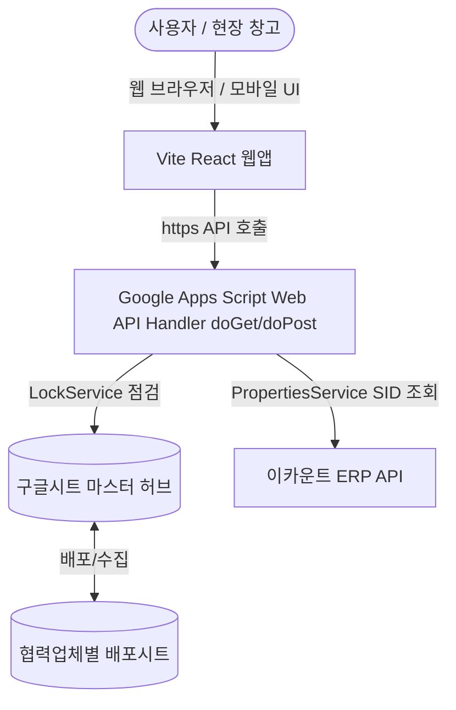

# 2026-05-24 팩투유(Pack2U) 웹앱 연동 및 마이그레이션 구현 계획서

본 계획서는 구글 스프레드시트 기반으로 운영되고 있는 팩투유(Pack2U) 위탁 배송 및 ERP 연동 시스템을 독립적인 모던 웹 애플리케이션(Web App) 대시보드와 실시간 연동하도록 아키텍처를 마이그레이션하기 위한 구현 계획을 정의합니다.

기존에 수립된 데이터 모델 설계(`WEB_MIGRATION_01`) 및 브리지 설계(`WEB_MIGRATION_02`)를 준수하며, 운영상의 충돌 및 꼬임 문제를 원천 차단하기 위한 세부 로직을 포함합니다.

---

## 1. 기존 시스템 분석 및 해결 과제 (충돌/꼬임 방지 검증)

새로운 웹앱 연동을 추가하기에 앞서, 기존 시스템과의 충돌 및 중복 동작 방지를 위해 다음과 같이 분석 및 안전장치를 수립합니다.

1. **시트 구조 및 열(Column) 보존**:
   - `moveToEcount.gs` 및 `priceManager.gs`는 시트의 특정 열 위치(Index)를 하드코딩하여 참조하고 있습니다.
   - 웹앱 연동 API를 개발할 때, **구글 시트의 열을 추가하거나 순서를 바꾸는 동작을 완전히 배제**합니다. 웹앱은 오로지 기존 구글 시트의 지정된 열 범위 내에서 셀 값을 읽고 쓰는 API만 수행합니다.
2. **동시 편집 및 매크로 충돌 방지**:
   - 사용자가 구글 시트 메뉴에서 직접 트리거를 실행하는 와중에 웹앱에서도 동일 기능을 동시 호출할 경우 데이터가 꼬이는(Race Condition) 대참사가 발생할 수 있습니다.
   - 이를 방지하기 위해 구글 Apps Script 내의 **`LockService.getScriptLock()`**을 활용해 웹앱 API 호출과 시트 내 수동 실행 간의 **상호 배제(Mutex)**를 구현합니다.
3. **직원별 Google OAuth 승인 우회 (0건 오류 근본 해결)**:
   - 기존에는 구글 시트 공유 편집자(직원)가 Apps Script 실행 시 개별적으로 권한 승인을 받아야 했고, 이를 수행하지 않으면 조용히 실패(0건 처리)하는 문제가 있었습니다.
   - 웹앱 API 배포 시 **"나(Owner)의 권한으로 웹앱 실행(Execute as me)"** 및 **"모든 사용자에게 접근 허용(Anyone)"** 옵션을 적용하여 배포합니다. 이로써 직원들은 별도의 Google 권한 승인 없이도 단일화된 웹앱 대시보드 UI를 통해 안전하게 작업을 수행할 수 있습니다.
4. **이카운트 ERP 세션 충돌 방지**:
   - `ecount.gs` 내 로그인 세션 ID(`_EC_SID`)가 `PropertiesService`를 통해 관리되고 있습니다. 웹앱 연동 API 또한 이 저장소의 세션을 공유하도록 설계하여, 중복 로그인으로 인한 세션 만료 및 HTTP 412 에러를 차단합니다.

---

## 2. 웹앱 연동 아키텍처 및 데이터 흐름

구글 시트를 데이터 마스터(SoT)로 계속 활용하면서, 웹앱이 브리지 역할을 하는 양방향 연동 구조를 채택합니다.

### 2.1 주요 기능 범위
1. **모던 통합 대시보드 (Dashboard Home)**:
   - 오늘 기준 총 주문 건수, 송장 매치율, ERP 전송 성공률 시각화.
   - 최근 자동화 실행 로그 및 에러코드 모니터링 (`업데이트실행로그` 탭 연동).
2. **원격 발주 시스템 제어 (Order Controller)**:
   - 대리판매 발주수집 (`partnerCollectOrders`)
   - 이카운트 업로드용 판매현황 갱신 (`partnerRebuildSalesUploadSheetManual`)
   - 대리공급업체 발주 Push (`partnerPushOrdersToExclusiveForms`)
   - 일괄 마감 처리 (`partnerDailyArchiveAll`)
   - 웹앱 UI의 단색 단추 클릭을 통해 트리거하고 진행 상태(Progress)를 시각적으로 확인.
3. **상품정보 최적화 및 이카운트 양방향 연동 (Product & Ecount Sync)**:
   - **이카운트 데이터 가져오기**: 기존 `ecount.gs` 기반의 이카운트 품목/재고 연동 파이프라인(Step 1~4)을 웹앱에서 호출하여 진행률을 시각적으로 모니터링하고 최종 `상품정보` 탭을 갱신.
   - **다이렉트 단가/재고 수정 및 전송 (역방향)**: 구글 시트를 다운로드/업로드하는 번거로움 없이, 웹앱의 상품 관리 화면에서 단가나 정보를 직접 고치면 웹앱 API가 이카운트 API를 호출해 이카운트 ERP와 구글 시트 마스터에 동시 자동 즉각 반영.
4. **카카오 송장매칭 웹 인터페이스 (Invoice Match Web UI)**:
   - 기존의 `invoiceMatchSidebar.html`을 독립된 웹앱 화면으로 확장.
   - 엑셀 드래그 앤 드롭 또는 텍스트 붙여넣기를 통해 실시간으로 수취인 이름과 송장번호 매핑.
   - 불일치 건수, 중복 건수 등을 보기 쉬운 Grid 표로 제공하고, 최종 승인 시 구글 시트에 일괄 반영.
5. **모바일 최적화 (현장 바코드/PDA 연동 대비)**:
   - 미니멀하고 시인성 높은 반응형 UI 설계로 태블릿 및 모바일 기기 완벽 대응.

---

## 3. 세부 구현 계획

### 3.1 Google Apps Script (GAS) API 핸들러 구현
- **파일명**: [_partnerWebApp.gs](file:///f:/Pack2U_상품정보sheet/_partnerWebApp.gs)
- **변경 사항**: 기존의 더미 함수들을 제거하고, 웹앱 프론트엔드와 통신하기 위한 `doGet(e)` 및 `doPost(e)` 표준 핸들러 구현.
  - `GET /action=getDashboardStatus`: 오늘 요약 통계 및 실행 로그 반환.
  - `GET /action=getVendorList`: `getPartnerFileListForSidebar()` 결과 반환 (업체 ID 및 명칭).
  - `POST /action=triggerOrderCollect`: 발주수집 매크로 실행.
  - `POST /action=triggerArchiveAll`: 일괄 마감 매크로 실행.
  - `POST /action=parseInvoices`: 송장 데이터 파싱 및 매칭 로직 호출.
  - `POST /action=applyInvoices`: 매칭 완료 송장 시트 일괄 반영.

### 3.2 웹 프론트엔드 구축
- **위치**: `f:\Pack2U_상품정보sheet\webapp_dashboard` (Vite + React + Vanilla CSS)
- **스타일 및 디자인 테마**:
  - HSL 색상 모델 기반의 **프리미엄 다크모드/글래스모피즘** 스타일.
  - **단색(Monochrome)의 고급스럽고 심플한 아이콘**만 적용 (사용자 규칙 엄수).
  - 브라우저 기본 서체 대신 현대적인 `Inter` 및 `Outfit` 폰트 적용.
  - 부드러운 호버 애니메이션 및 트랜지션 적용.

---

## 4. 검증 및 배포 계획 (Verification)

### 4.1 수동 및 자동 검증 절차
1. **API 기능 단독 검증**:
   - Postman 또는 Curl을 사용해 GAS 배포 API의 End-point 정상 응답 여부 확인.
   - Lock 동작 시 에러코드(`BRIDGE_CONFLICT_DETECTED`)가 올바르게 웹앱으로 반환되는지 테스트.
2. **웹 대시보드 로컬 실행**:
   - `npm run dev`를 통한 로컬 웹 서버 구동 후 UI 렌더링, 다크모드, 반응형 레이아웃 확인.
3. **송장 매칭 시나리오 테스트**:
   - 가상의 송장 텍스트를 입력하고 분석하여, 올바른 매칭 목록과 오류 목록이 화면에 렌더링되는지 확인.
   - '전용양식에 반영' 버튼 클릭 시, 구글 시트 마스터에 정확하게 송장 정보가 써지는지 확인.
4. **일괄 마감 아카이브 연동 테스트**:
   - 테스트용 발주 탭에서 아카이브 명령을 웹앱을 통해 내리고, 시트의 행 이동 및 월별 탭 생성이 잘 이뤄지는지 확인.
