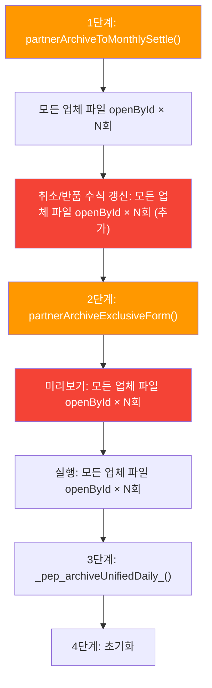

# 일괄 마감 시간초과 & 발주 수집 속도 개선 분석

## 🔍 문제 현상 요약

| 증상 | 설명 |
|------|------|
| 일괄 마감 시간초과 | 회사 계정(소유자)은 정상, **다른 계정은 시간초과 2~3건** |
| 발주 수집 느림 | 전체 발주 수집(`partnerCollectOrders`) 실행 시간이 체감적으로 오래 걸림 |

---

## 🧪 근본 원인 분석

### 원인 1: GAS 실행 시간 제한 — 계정 유형별 차이

> [!IMPORTANT]
> Google Apps Script 실행 시간 제한:
> - **Google Workspace (유료 계정)**: **30분**
> - **무료 Gmail 계정**: **6분**
>
> 회사 계정(소유자)이 Workspace 계정이면 30분 여유가 있어 정상 완료되지만,
> **다른 직원이 무료 Gmail 계정이면 6분 제한에 걸려 시간초과** 발생

이것이 **"회사 계정은 되고 다른 계정은 안 되는"** 핵심 원인입니다.

---

### 원인 2: 일괄 마감 — 파일을 4~5회 중복 열기

현재 `partnerDailyArchiveAll()` ([_partnerWebApp.gs:195](file:///f:/Pack2U_상품정보sheet/_partnerWebApp.gs#L195))의 실행 흐름:



**`SpreadsheetApp.openById()`는 파일당 1~3초** 소요되는 무거운 API 호출입니다.

| 단계 | 파일 열기 횟수 | 비고 |
|------|:---:|------|
| 1단계 월별정산 ([_partnerMonthlySettle.gs:176](file:///f:/Pack2U_상품정보sheet/_partnerMonthlySettle.gs#L176)) | N회 | files.forEach → openById |
| 1단계 취소반품 수식갱신 ([_partnerMonthlySettle.gs:452](file:///f:/Pack2U_상품정보sheet/_partnerMonthlySettle.gs#L452)) | N회 | ★ 추가 루프! |
| 2단계 전용마감 미리보기 ([_partnerExclusiveArchive.gs:349](file:///f:/Pack2U_상품정보sheet/_partnerExclusiveArchive.gs#L349)) | N회 | _pea_preview_ |
| 2단계 전용마감 실행 ([_partnerExclusiveArchive.gs:80](file:///f:/Pack2U_상품정보sheet/_partnerExclusiveArchive.gs#L80)) | N회 | _pea_core_ |
| **합계** | **4N회** | 업체 10개 = 40~120초 낭비 |

> [!CAUTION]
> 업체 10개 기준 `openById` 호출만 **40회** → 최소 **40~120초 순수 파일 열기 시간**.
> 나머지 작업(데이터 읽기/쓰기) 포함 시 6분 제한을 쉽게 초과합니다.

---

### 원인 3: 발주 수집 — 무거운 부가 작업이 업체마다 실행

[_partnerOrders.gs:327](file:///f:/Pack2U_상품정보sheet/_partnerOrders.gs#L327)의 `partnerCollectOrders()`:

| 업체별 부가 작업 | 소요 시간 추정 | 위치 |
|---|:---:|---|
| `_pt_cleanupStrayValidations_()` | 0.5~1초/업체 | [line 470](file:///f:/Pack2U_상품정보sheet/_partnerOrders.gs#L470) |
| `_pt_healOrderSpillFormulas()` | 1~3초/업체 | [line 505](file:///f:/Pack2U_상품정보sheet/_partnerOrders.gs#L505) |
| 뷰어 탭 전체 읽기 (priceMap 구축) | 1~2초/업체 | [line 424](file:///f:/Pack2U_상품정보sheet/_partnerOrders.gs#L424) |
| 상태열 자동 추가 (`data` 재로드) | 0.5~1초/일부 업체 | [line 473](file:///f:/Pack2U_상품정보sheet/_partnerOrders.gs#L473) |

업체 10개 기준: **수집 본작업 + 부가작업 = 20~60초 추가 소요**

특히 `_pt_healOrderSpillFormulas()`는 **수식 폐기 후 값 기반으로 전환한 6/17 변경** 이후에도 여전히 호출되고 있는데, 이 함수는 `getDisplayValues()` 3회(A열, D열, L열) + `getFormulas()` 2회(D열, L열) 등 **읽기만 해도 5회 이상 API 호출**을 합니다.

---

### 원인 4: 2단계 전용마감 — UI 확인 대화상자

[_partnerExclusiveArchive.gs:37](file:///f:/Pack2U_상품정보sheet/_partnerExclusiveArchive.gs#L37)에서 `ui.alert()`로 사용자 확인을 받는데, **일괄 마감 시에는 이 확인 대화상자가 불필요**합니다. 또한 확인 대화상자 전에 미리보기(`_pea_preview_`)가 **모든 파일을 한 번 더 열어** 데이터를 스캔합니다.

---

## 📋 제안 개선 방안

### [최적화 1] 일괄 마감 파일 루프 통합 ⭐ 핵심

**현재**: 단계별로 별도 루프 → 4N회 openById
**변경**: 단일 루프에서 1번만 openById → 한 파일 안에서 월별정산 + 전용마감 동시 처리

```
// 의사코드
for (각 업체 파일) {
  var ss = SpreadsheetApp.openById(file.id); // ★ 1번만!
  
  // 1단계: 월별정산 (발주탭 → 마감탭)
  _pms_processOneFile_(ss, ...);
  
  // 2단계: 전용마감 (전용양식 → 전용마감탭)  
  _pea_processOneFile_(ss, ...);
  
  SpreadsheetApp.flush();
}
// 3단계: 일일마감 (기존 그대로)
// 4단계: 초기화 (기존 그대로)
```

**예상 효과**: 파일 열기 4N → 1N으로 **75% 감소** (업체 10개 기준 30~90초 절약)

---

### [최적화 2] 발주 수집 시 heal/cleanup 조건부 실행

현재 `healOrderSpillFormulas`와 `cleanupStrayValidations`가 **모든 업체마다 무조건 실행**됩니다.

**변경안**:
- `healOrderSpillFormulas`: 6/17에 값 기반으로 전환 완료됐으므로, **D/L열 heal은 스킵**하고 A열(ARRAYFORMULA) heal만 #REF 감지 시 실행
- `cleanupStrayValidations`: **한 번 정리된 후에는 재발하지 않으므로**, 발주 수집 루프에서 제거하고 별도 AS 도구로만 유지

**예상 효과**: 업체당 2~4초 절약 → 10개 업체 기준 **20~40초 절약**

---

### [최적화 3] 취소/반품 수식 갱신 최적화

현재 [_partnerMonthlySettle.gs:448](file:///f:/Pack2U_상품정보sheet/_partnerMonthlySettle.gs#L448)의 `_pms_refreshCancelReturnFormulas_`가 마감 이동 후 **모든 업체 파일을 다시 열어** 취소/반품 수식을 갱신합니다.

**변경안**: 통합 루프에서 이미 ss 객체를 열고 있으므로, 같은 루프 안에서 처리

---

### [최적화 4] 2단계 전용마감 — 미리보기/확인 생략 (일괄 실행 시)

**변경안**: `_pea_core_()` 직접 호출 (미리보기+UI 확인 우회)

**예상 효과**: 파일 열기 N회 + 대화상자 대기 시간 **완전 제거**

---

### [최적화 5] 경과 시간 안전 체크

6분 제한 대비 **경과 시간 체크 + 조기 종료** 로직 추가:

```javascript
var MAX_EXEC_MS = 5 * 60 * 1000; // 5분 (1분 여유)
var startMs = Date.now();

for (var fi = 0; fi < files.length; fi++) {
  if (Date.now() - startMs > MAX_EXEC_MS) {
    // 남은 업체는 다음 실행으로 이월
    break;
  }
  // ... 처리
}
```

---

## 📊 예상 개선 효과 (업체 10개 기준)

| 항목 | 현재 추정 | 개선 후 추정 | 절약 |
|------|:---:|:---:|:---:|
| openById 호출 | 40회 (~120초) | 10회 (~30초) | **90초** |
| heal/cleanup | ~40초 | ~5초 | **35초** |
| 미리보기+확인 | ~40초 | 0초 | **40초** |
| 취소반품 수식 | ~30초 | 0초(통합) | **30초** |
| **합계** | **~4분+** | **~1분 내** | **~3분** |

> [!TIP]
> 이 최적화를 적용하면 무료 Gmail 계정(6분 제한)에서도 **안정적으로 완료** 가능할 것으로 예상됩니다.

---

## 확인 필요 사항

> [!IMPORTANT]
> **다른 계정 사용자들의 Google 계정이 무료 Gmail인지 Workspace인지 확인 부탁드립니다.**
> - 무료 Gmail: 6분 제한 (이것이 시간초과의 직접 원인)
> - Workspace: 30분 제한 (이 경우 다른 원인 조사 필요)
>
> 만약 모두 Workspace 계정이라면, 해당 직원이 스크립트 권한 승인을 했는지도 확인해야 합니다.
> (권한 미승인 상태에서는 다른 오류가 날 수 있음)

---

## 검증 계획

1. **코드 변경 후**: `clasp push`로 배포
2. **일괄 마감 테스트**: 다른 계정으로 실행 → 시간초과 여부 확인
3. **발주 수집 테스트**: 실행 시간 비교 (변경 전/후)
4. **데이터 정합성**: 마감 이동된 데이터가 기존과 동일한지 확인
