# 📋 B2C/B2B 쇼핑몰 및 물류 자동화 시스템 사업계획서

> **Pack2U — 주문에서 배송까지, 모든 물류를 하나로**
> 작성일: 2026년 7월 3일

---

## 1. 우리가 하는 일

### 1.1 한 줄 소개

> **"혼자서도 하루 2,000건을 처리할 수 있는 시스템을 만듭니다"**

Pack2U는 온라인 쇼핑몰 운영에 필요한 **모든 물류 과정을 자동화**하는 시스템입니다.
쿠팡, 네이버, 11번가 같은 여러 판매 채널에서 들어오는 주문을 한곳에 모으고,
협력업체에 자동으로 발주하고, 택배 송장을 받아서, 정산까지 알아서 처리합니다.

처음에는 엑셀처럼 생긴 구글 시트에서 시작했지만,
지금은 **자체 웹앱과 쇼핑몰 앱**까지 만들어가고 있습니다.
대단한 팀이 있었던 게 아니라, **AI와 함께 1인 개발**로 여기까지 왔습니다.

### 1.2 지금 돌아가고 있는 것들

| 구분 | 뭘 하는 건가요? | 상태 |
|:---:|---|:---:|
| **B2B 발주시스템** | 협력업체 38곳과 매일 주문/송장/정산을 주고받아요 | ✅ 매일 사용 중 |
| **상세페이지 제작** | 상품 이미지를 넣으면 HTML 상세페이지로 자동 변환해요 | ✅ 운영 중 |
| **ERP 연동** | 이카운트 ERP와 재고·매출·매입을 자동으로 맞춰요 | ✅ 운영 중 |
| **협력업체 웹앱** | 구글시트를 벗어나 웹에서 발주/조회할 수 있어요 | 🔨 만드는 중 |
| **B2C 쇼핑몰 앱** | 일반 소비자가 직접 주문할 수 있는 앱이에요 | 📋 기획 단계 |
| **마케팅 자동화** | AI로 광고 이미지와 홍보 영상을 자동 제작해요 | 📋 준비 중 |

### 1.3 왜 우리가 할 수 있나요?

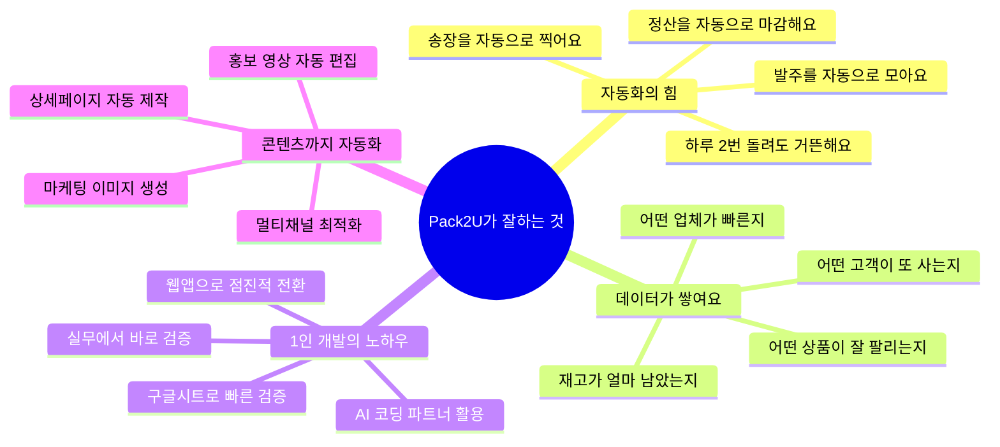

---

## 2. 지금까지 만든 것들

### 2.1 전체 그림

아래 그림이 Pack2U 시스템의 전체 모습입니다.
왼쪽에서 주문이 들어오면, 가운데에서 처리하고, 오른쪽으로 배송이 나갑니다.

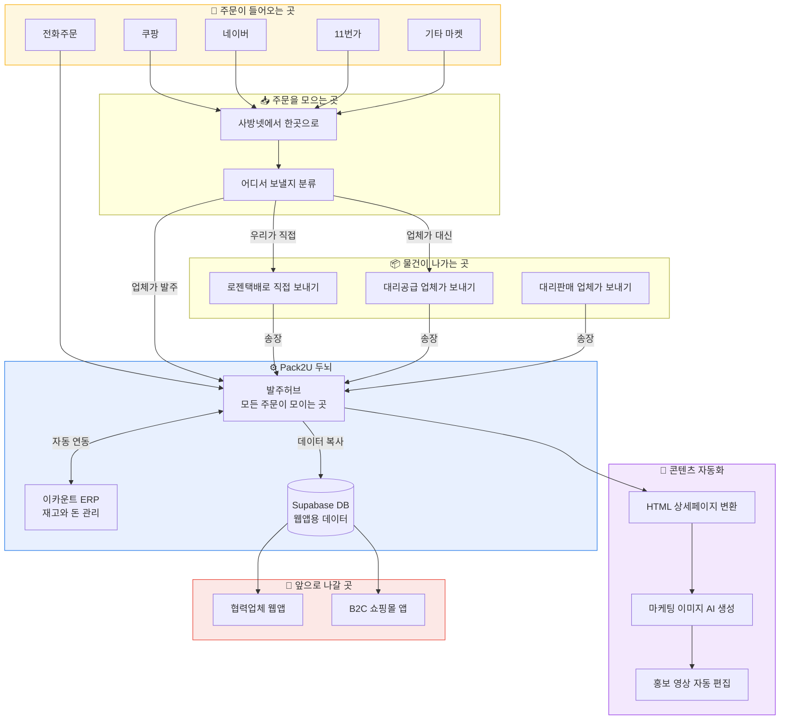

### 2.2 하루 일과 — 이렇게 흘러갑니다

매일 오전 9시부터 저녁 8시까지, 시스템이 자동으로 일합니다.
사람은 중간중간 확인하고 예외만 처리하면 됩니다.

```mermaid
gantt
    title 하루가 이렇게 흘러갑니다
    dateFormat HH:mm
    axisFormat %H:%M

    section 오전 1회전
    주문 다운로드                  :a1, 09:00, 15min
    발주 자동 수집                 :a2, after a1, 15min
    ERP에 보내기                   :a3, after a2, 30min
    자사 vs 대리 분류              :a4, after a3, 30min
    대리공급 발송 요청             :a5, after a4, 20min

    section 오후 2회전
    초기화 후 재입력               :b1, 14:00, 20min
    2차 발송 요청                  :b2, 14:20, 20min

    section 송장 처리
    송장 자동 수집                 :c1, 15:30, 20min
    오류 확인 및 사방넷 입력       :c2, after c1, 35min
    업체에 송장 배포               :c4, after c2, 20min

    section 마감
    통합 일일마감 자동 실행         :d1, 20:00, 30min
```

### 2.3 하나씩 뜯어보면

#### A. 협력업체 발주/정산 시스템 — 매일 쓰는 핵심

38개 협력업체와 주문을 주고받고, 정산하는 시스템입니다.
원래는 전화/카톡으로 하던 걸 시스템이 알아서 합니다.

| 이런 일을 해요 | 어떻게 동작하나요 | 사람이 할 일 |
|---|---|:---:|
| **발주 모으기** | 업체가 시트에 입력하면 자동으로 허브에 모여요 | 확인만 |
| **단가 관리** | 품목 코드 넣으면 가격이 자동으로 뜨고, 변경되면 전체 배포 | 없음 |
| **송장 매칭** | 택배사에서 송장 받으면 주문번호별로 자동 매칭 | 오류 확인 |
| **송장 배포** | 매칭된 송장을 각 업체 시트에 자동 기록 | 없음 |
| **월별 정산** | 매달 마감탭을 자동 생성하고 데이터를 옮겨요 | 확인만 |
| **입력 실수 잡기** | 필수 항목(수량, 주소 등) 빠지면 바로 알려줘요 | 없음 |
| **도서산간 감지** | 우편번호만 보고 추가배송비 대상을 자동 분류 | 없음 |

#### B. HTML 상세페이지 자동 변환 시스템 ✅ 운영 중

쇼핑몰에 상품을 등록하려면 예쁜 상세페이지가 필요합니다.
디자이너 없이도 **상품 이미지만 넣으면 HTML 상세페이지가 뚝딱** 만들어집니다.

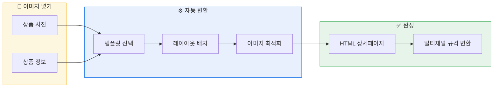

| 기능 | 설명 |
|---|---|
| **템플릿 기반** | 업종/상품 유형별 여러 템플릿 중 선택 |
| **이미지 자동 배치** | 사진만 넣으면 정해진 레이아웃에 맞춰 배치 |
| **멀티채널 대응** | 쿠팡/네이버/11번가 규격에 맞게 자동 변환 |
| **모바일 최적화** | 모바일에서 보기 좋게 자동 리사이즈 |
| **HTML 코드 복사** | 완성된 HTML을 복사해서 바로 상품 등록 |

#### C. GAS 라이브러리 — 유지보수의 고통을 끝냈습니다

원래 코드를 수정하면 38개 업체 시트에 하나씩 다시 설치해야 했어요.
몇 시간씩 걸리는 고통이었는데, 이제는 **코드 한 번 올리면 끝**입니다.

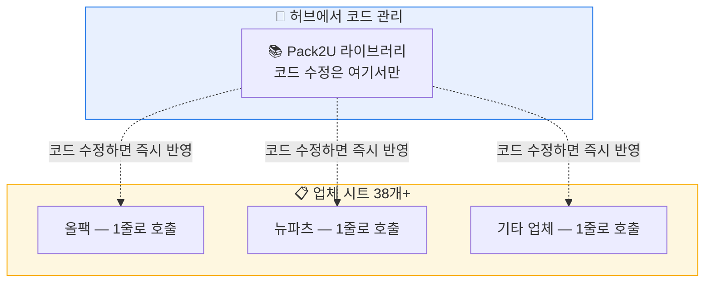

> 예전: 코드 수정 → 38개 시트 재설치 (1시간+) 😩
> 지금: 코드 수정 → `clasp push` 한 번 → 끝! (30초) 🎉

#### D. 이카운트 ERP 연동

재고, 매출, 매입 데이터가 이카운트와 자동으로 맞춰집니다.
숫자가 안 맞아서 야근하는 일이 사라졌어요.

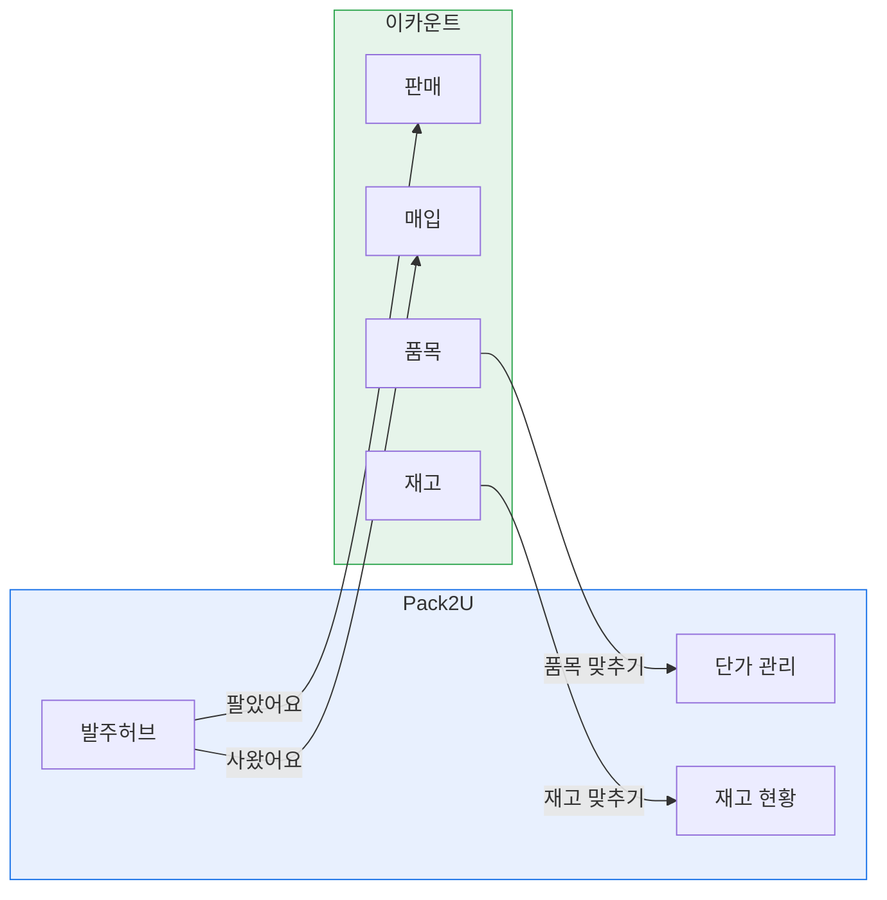

---

## 3. 주문은 이렇게 흘러갑니다

### 3.1 하루에 들어오는 주문의 종류

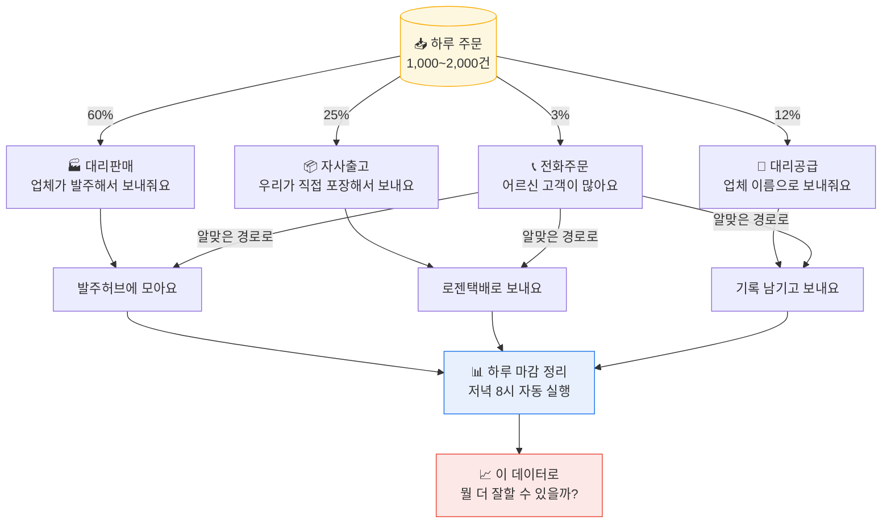

### 3.2 돈은 이렇게 벌고 있어요

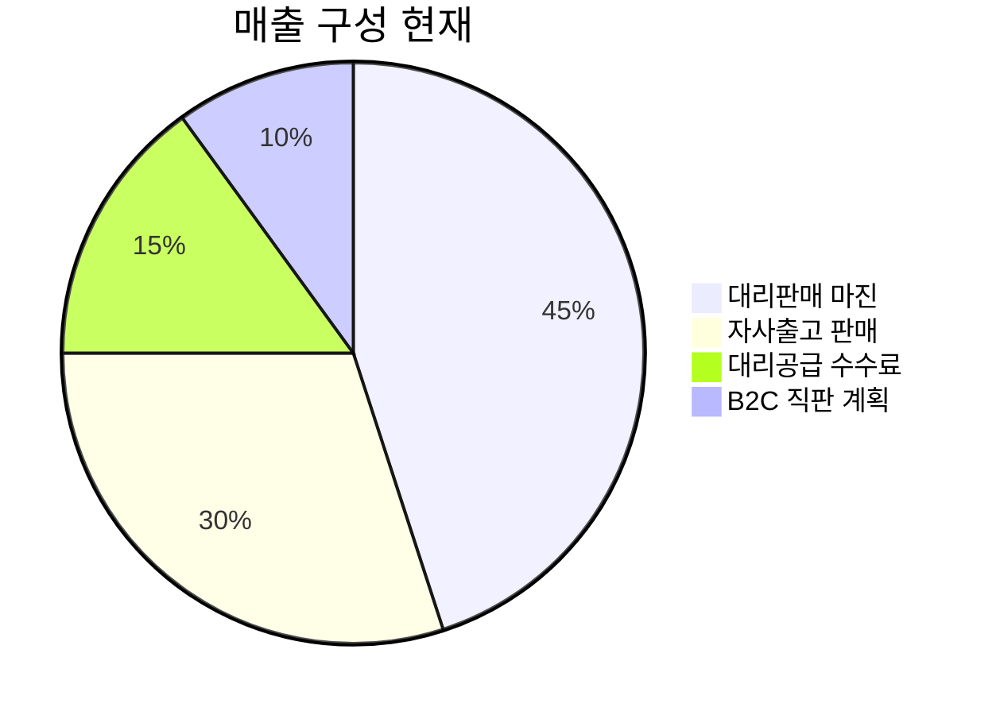

---

## 4. 앞으로의 계획

### 4.1 로드맵 — 한 발짝씩

혼자 시작했으니까, 욕심부리지 않고 한 단계씩 갑니다.
검증된 것만 확장하고, 안 되면 빨리 접고 다른 길을 찾습니다.

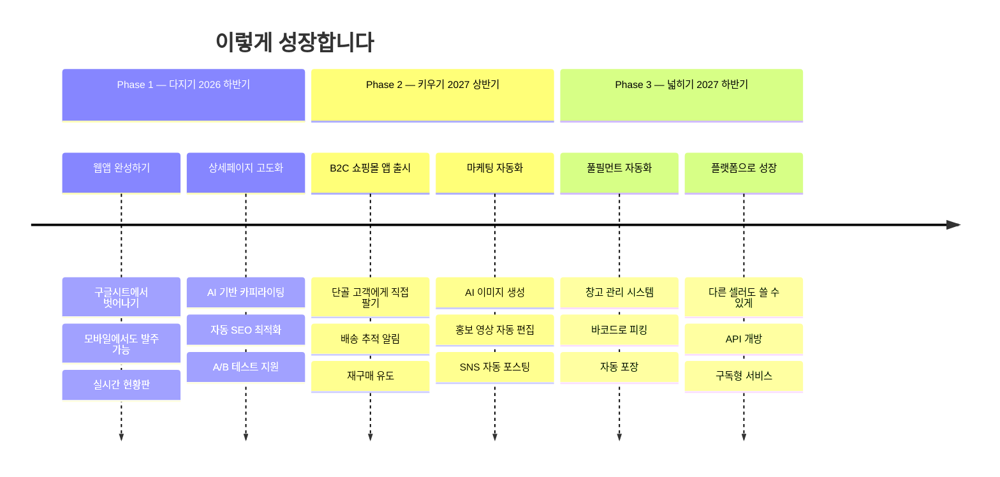

### 4.2 Phase 1 — 다지기 (2026년 하반기)

지금 돌아가는 시스템을 **더 안정적이고 편하게** 만드는 단계입니다.
구글시트 의존도를 줄이고, 웹에서 모든 걸 할 수 있게 합니다.

| 할 일 | 왜 필요한가요 | 언제까지 |
|---|---|:---:|
| 웹앱 쓰기 기능 | 구글시트 없이도 발주 입력/수정/취소 가능 | 2026.08 |
| 실시간 현황판 | 오늘 매출, 주문 상태를 한눈에 | 2026.08 |
| 모바일 최적화 | 출장 중에도 스마트폰으로 확인 | 2026.09 |
| 상세페이지 AI 카피 | 상품명만 넣으면 설명문구까지 자동 생성 | 2026.09 |
| 라이브러리 전환 완료 | 코드 수정 시 재설치 불필요 | 2026.07 ✅ |
| DB 이중화 | 시트 데이터를 DB에도 보관 (안전장치) | 2026.08 |

### 4.3 Phase 2 — 키우기 (2027년 상반기)

쌓인 데이터와 고객 정보를 활용해서 **직접 팔기 시작**합니다.
마케팅 콘텐츠도 AI가 만들어줍니다.

#### A. B2C 쇼핑몰 앱

매일 처리하는 주문 데이터에서 보이는 **단골 고객**에게 직접 팔면 마진이 훨씬 좋습니다.
플랫폼 수수료(쿠팡 30%, 네이버 10%)를 줄일 수 있어요.

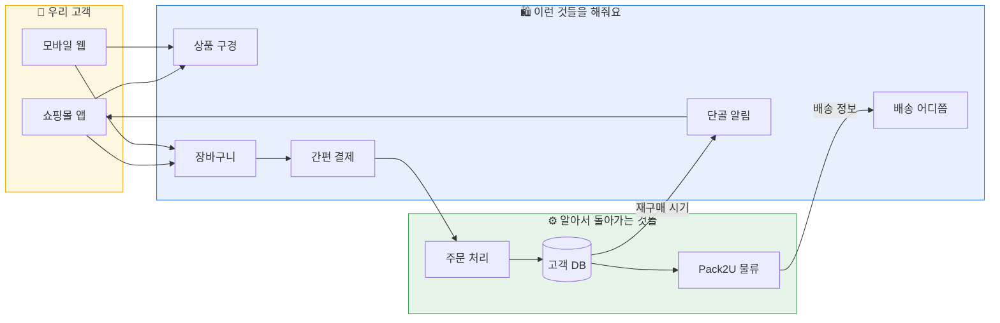

| 기능 | 왜 필요해요? |
|---|---|
| **단골 고객 관리** | 이미 10번 이상 산 고객이 수백 명, 직접 팔면 수수료 절약 |
| **재구매 알림** | 건강식품은 30일마다, 생활용품은 60일마다 알림 |
| **배송 추적** | 로젠택배 API 연동, "내 택배 어디쯤?" |
| **간편 결제** | 토스/카카오페이, 한 번 등록하면 원터치 결제 |

#### B. 마케팅 이미지 · 영상 자동 생성 시스템 🆕

상품을 잘 만드는 것만큼 **잘 보여주는 것**도 중요합니다.
AI로 마케팅 콘텐츠를 자동으로 만들어서, 디자이너 없이도 고퀄리티 광고를 돌립니다.

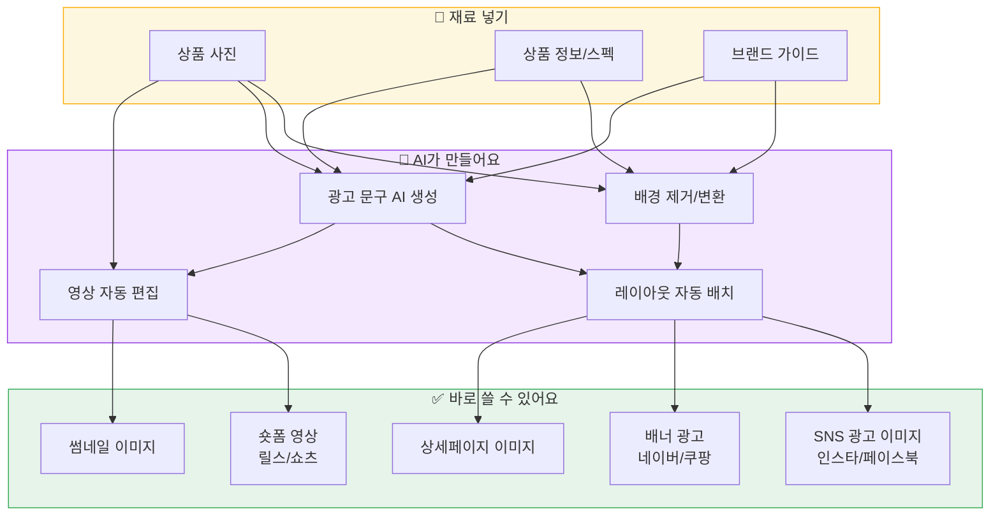

| 기능 | 어떻게 동작하나요 | 기대 효과 |
|---|---|---|
| **배경 자동 변환** | 상품 사진 배경을 화이트/라이프스타일로 자동 교체 | 스튜디오 촬영비 절약 |
| **광고 문구 생성** | 상품 특징 입력하면 AI가 매력적인 카피 작성 | 카피라이터 비용 절약 |
| **채널별 이미지** | 한 장의 원본으로 SNS, 배너, 상세페이지 규격 자동 변환 | 작업 시간 90% 감소 |
| **숏폼 영상** | 상품 이미지 + 문구로 15~30초 영상 자동 제작 | 영상 제작 비용 절약 |
| **A/B 테스트** | 여러 버전 자동 생성 → 성과 측정 → 최적안 선택 | 광고 효율 극대화 |

#### C. 데이터로 더 똑똑하게

| 이런 걸 해볼 수 있어요 | 어떤 데이터를 쓰나요 | 뭐가 좋아지나요 |
|---|---|---|
| **잘 팔릴 상품 예측** | 지난 매출 추이 | 재고를 미리 준비 |
| **자동 재발주** | 판매 속도 + 입고 시간 | 결품 없이 운영 |
| **단골 고객 찾기** | 수취인 + 전화번호 반복 | VIP 맞춤 혜택 |
| **최적 가격 찾기** | 플랫폼별 판매단가 | 채널별 최고 마진 |

### 4.4 Phase 3 — 넓히기 (2027년 하반기~)

잘 돌아가는 시스템을 **다른 셀러도 쓸 수 있게** 열어줍니다.

#### 풀필먼트 자동화

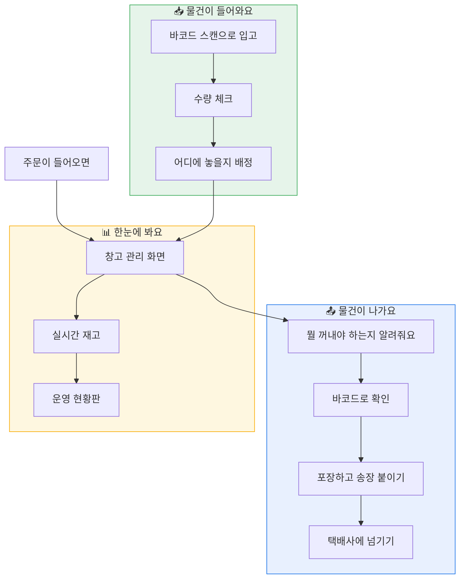

#### 다른 셀러에게도 열어주기 (SaaS)

| 서비스 | 누구한테 팔아요 | 어떻게 벌어요 |
|---|---|---|
| **Pack2U API** | 다른 셀러/물류사 | 주문 건당 과금 |
| **발주 관리 SaaS** | 중소 유통업체 | 월 구독료 |
| **상세페이지/마케팅 SaaS** | 쇼핑몰 운영자 | 이미지/영상 건당 과금 |
| **풀필먼트** | 물류 위탁 원하는 셀러 | 건당 + 보관비 |

---

## 5. 기술 스택

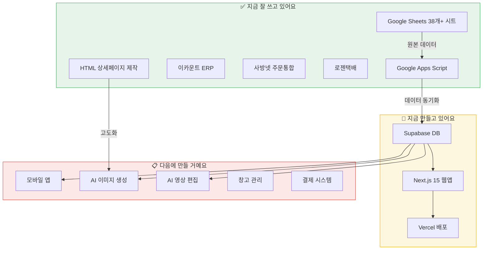

---

## 6. 팀과 비용

### 6.1 이렇게 시작합니다

지금은 **1인 개발 + AI 코딩 파트너**로 운영합니다.
시스템이 돈을 벌기 시작하면, 그 수익으로 한 명씩 늘려갑니다.
"대규모 투자 받고 팀 꾸리고 시작"이 아니라, **작게 시작해서 검증하고 키우는 방식**입니다.

### 6.2 인원 계획

| 역할 | 지금 | Phase 1 | Phase 2 | Phase 3 |
|---|:---:|:---:|:---:|:---:|
| **대표 (운영+개발)** | 1명 👨‍💻 | 1명 | 1명 | 1명 |
| **AI 코딩 파트너** | 상시 🤖 | 상시 | 상시 | 상시 |
| **물류 담당** | 1명 | 1명 | 1~2명 | 2~3명 |
| **개발자** | - | - | 1명 (채용) | 2명 |
| **마케팅/CS** | - | - | 1명 (채용) | 1~2명 |
| **디자인** | - | - | - | 1명 |
| **합계** | **2명+AI** | **2명+AI** | **4~5명+AI** | **7~9명+AI** |

> 💡 **핵심 원칙**: AI가 할 수 있는 일은 AI에게. 사람은 판단과 소통에 집중.

### 6.3 투자 계획

| 단계 | 기간 | 주요 비용 | 규모 |
|---|---|---|:---:|
| Phase 1 | 2026 하반기 | 서버 비용, AI API 비용 | 자체 수익으로 충당 |
| Phase 2 | 2027 상반기 | 앱 개발, 인건비 1~2명 | 소규모 투자 필요 |
| Phase 3 | 2027 하반기~ | WMS 구축, 팀 확장 | 시리즈 A 또는 자체 성장 |

### 6.4 목표 수치

이게 되면 잘 가고 있는 겁니다:

| 이걸 봐요 | 지금 | 1단계 목표 | 2단계 목표 |
|---|:---:|:---:|:---:|
| 하루 주문 처리량 | 1,000~2,000건 | 2,500건 | 5,000건 |
| 자동화율 | 75% | 90% | 95% |
| 송장 매칭 오류 | 2% | 0.5% | 0.1% |
| 협력업체 수 | 38개 | 50개 | 80개 |
| B2C 직판 매출 비중 | 0% | 5% | 20% |
| 상세페이지 제작 시간 | 30분/건 | 5분/건 | 1분/건 |
| 마케팅 이미지 제작 | 수동 | 반자동 | 완전 자동 |

---

## 7. 걱정되는 것과 대비책

솔직히 걱정되는 것도 있습니다. 하지만 대비책도 있습니다.

| 걱정되는 것 | 얼마나 | 이렇게 대비해요 |
|---|:---:|---|
| 혼자서 감당이 될까 | 🟡 | AI 파트너가 10명 몫을 해줘요. 안 되면 한 명 뽑아요 |
| 구글이 서비스 바꾸면 | 🟡 | Supabase DB로 이중화 진행 중. 시트 없어도 웹앱으로 운영 가능 |
| 데이터 날아가면 | 🔴 | 시트 + Supabase 이중 보관. 매일 자동 백업 |
| 보안 문제 | 🔴 | Row Level Security + 접근 권한 관리 적용 완료 |
| 쇼핑몰 수수료 인상 | 🟡 | B2C 직판 비중 늘려서 의존도 낮추기 |
| 더 좋은 경쟁자 | 🟢 | 38개 업체 네트워크 + 커스터마이징이 우리만의 장벽 |

---

## 8. 결론 — 우리의 여정

시작은 소박했습니다. 엑셀 같은 구글 시트에서 주문을 관리하던 것이 시작이었어요.
그런데 AI와 함께 코드를 짜고, 자동화를 만들고, 시스템을 키우다 보니
**하루 2,000건을 2명이 처리하는** 데까지 왔습니다.

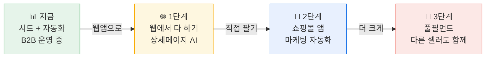

> **"작게 시작해서, 검증하고, 키운다."**
>
> 1인 개발로 시작했지만, 시스템이 성장하면 팀도 성장합니다.
> 디자이너 없이 상세페이지를 만들고, 영상팀 없이 홍보 영상을 만들고,
> 물류팀 없이 하루 2,000건을 처리하는 것.
>
> 이게 Pack2U가 증명하고 있는 것이고, 앞으로 더 증명할 것입니다.

---

*Pack2U — 혼자 시작해서, 함께 성장하는 물류 자동화 플랫폼*
